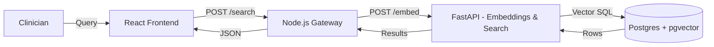
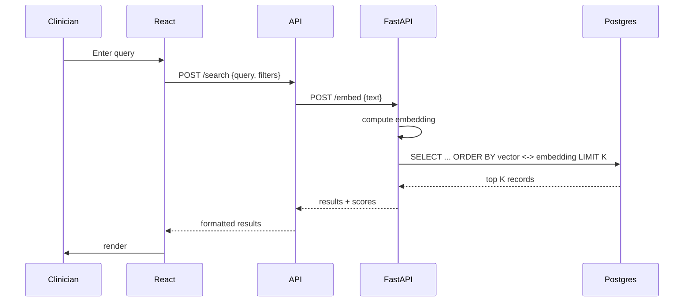

# Semantic Search for Homeopathy EMR

## Project description

A concise, production-oriented semantic search system for Homeopathy EMR. It replaces brittle keyword search with meaning-aware retrieval over clinical text and structured EMR fields, returning ranked patient records, encounter notes, and prescriptions relevant to a clinician's natural-language query.

Why this matters:
- Clinicians use varied language; semantic search surfaces relevant records despite synonyms, abbreviations, and paraphrases.
- Faster, more accurate retrieval improves clinical workflow and decision-making.

## How it works (high level)

- Frontend sends a natural-language query to the API gateway.
- The gateway forwards the query to the ML service which computes an embedding.
- The ML service runs a vector similarity search against PostgreSQL (pgvector) and returns ranked results.
- The gateway formats results and returns them to the React frontend for display.

## Embeddings & Vector Search

- Embeddings: represent text (notes, excerpts) as dense numeric vectors using a model (local SentenceTransformers or hosted embeddings API).
- Storage: store vectors in a `pgvector` column in Postgres and keep lightweight metadata for fast retrieval.
- Search: use cosine or inner-product similarity to find nearest neighbors; combine with simple filters (patient id, date range) for precision.

## Tech stack

- Frontend: React.js
- Gateway/API: Node.js (Express)
- ML service: Python FastAPI (embeddings + search)
- Database: PostgreSQL with `pgvector` extension
- Optional: Redis (cache), Docker (orchestration), local model store

## Architecture diagram



## Request workflow



## Data model (concise)

- `patients(id, name, dob, ...)`
- `encounters(id, patient_id, date, doctor_id, ...)`
- `notes(id, encounter_id, text, created_at, excerpt)`
- `note_embeddings(note_id, vector pgvector, created_at)`

Indexing strategy:
- Batch process new/changed notes: compute embedding, upsert into `note_embeddings` with snippet metadata.

## API examples

- `POST /search` — body `{ "query": "severe nightly headaches", "top_k": 10, "filters": {"patient_id": 123} }`
- `POST /internal/embed` — body `{ "text": "..." }` returns an embedding vector or directly runs the search and returns results.
- `GET /records/:id` — return full EMR details for a given record.

## Local quickstart

Prereqs: Node 16+, Python 3.9+, PostgreSQL 13+, `pgvector` installed.

1) Create DB and enable `vector`:

```powershell
createdb homeopathy_emr
psql homeopathy_emr -c "CREATE EXTENSION IF NOT EXISTS vector;"
```

2) Start FastAPI (embeddings & search):

```powershell
cd services/fastapi
python -m venv .venv
.venv\Scripts\activate
pip install -r requirements.txt
uvicorn main:app --reload --port 8001
```

3) Start Node gateway:

```powershell
cd services/node-api
npm install
npm run dev
```

4) Start React frontend:

```powershell
cd frontend
npm install
npm start
```

## Recommendations & next steps

- Add RBAC and audit logging for EMR compliance.
- Provide an indexing script and small demo dataset for onboarding.
- Add tests and CI for the embedding pipeline to ensure reproducible vectors.

---

Updated `Readme.md` with clearer description, compact diagrams, and an embeddings section.

