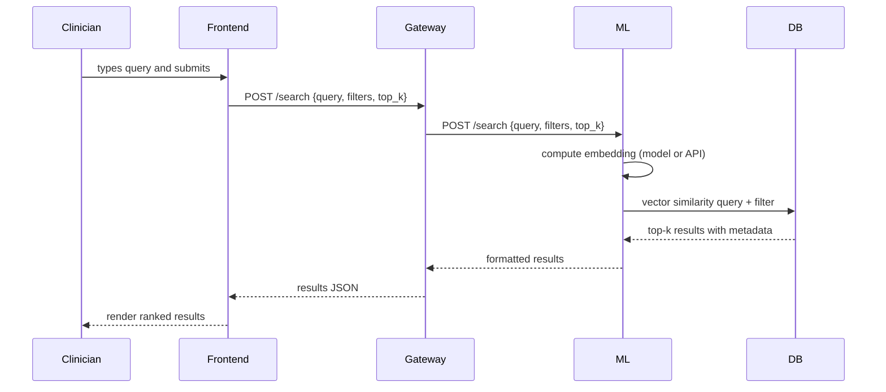

# Project Flow — Semantic Search for Homeopathy EMR

This document explains end-to-end data flow, request handling, embedding generation, vector search, and response rendering for the Semantic Search project.

## Overview

Components:
- `frontend` — React app (user input, display)
- `services/node-api` — Node.js API gateway (request validation, orchestration)
- `services/fastapi` — Python FastAPI (embedding generation, vector search)
- `PostgreSQL (pgvector)` — stores vectors and metadata

## High-level sequence



## Detailed step-by-step

1. Clinician enters a natural-language query in the React UI and presses Search.
2. Frontend sends a POST to the Node gateway `/search` with JSON: `{query, top_k, filters}`.
3. Node gateway performs authentication/validation (add RBAC in production), then forwards to FastAPI `/search`.
4. FastAPI computes an embedding for the query. Options:
   - Call a hosted embedding API (OpenAI, Cohere) and return the vector.
   - Use a local model (SentenceTransformers) to compute the embedding.
5. FastAPI executes a vector similarity query against Postgres with `pgvector`:
   - SQL example: `SELECT note_id, patient_id, excerpt, vector <-> $1 AS score FROM note_embeddings WHERE <filters> ORDER BY score LIMIT $2;`
   - Use `cosine_distance` or inner product depending on embedding normalization.
6. Postgres returns the top-k rows with scores and metadata.
7. FastAPI optionally enriches results with additional fields (e.g., fetch full note text from `notes` table) and returns a JSON payload to the gateway.
8. Node gateway applies response shaping (mask PHI if necessary), logs audit info, and returns results to the frontend.
9. Frontend renders results with score, snippet, patient id, and links to view the full record.

## Diagram: Architecture (components)

```mermaid
flowchart LR
  subgraph UI
    FE[React Frontend]
  end
  subgraph API
    API[Node.js Gateway]
  end
  subgraph ML
    FASTAPI[FastAPI - Embeddings & Search]
  end
  DB[(Postgres + pgvector)]

  FE --> API --> FASTAPI --> DB
```

## Security & privacy notes

- Always authenticate and authorize requests at the gateway.
- Mask or redact protected health information in logs.
- Consider on-premise/local embedding models to avoid sending PHI to external APIs.
- Use TLS for all service-to-service and client-to-service communication.

## Operational notes

- Indexing: provide a batch or streaming indexer to compute embeddings for new or changed notes and upsert to `note_embeddings`.
- Backfills: support re-indexing with a checkpoint to resume.
- Monitoring: add health checks, request tracing, and vector-store metrics.

## Files created by scaffold

- `services/fastapi/main.py` — FastAPI starter with `/internal/embed` and `/search` stubs
- `services/fastapi/requirements.txt` — Python deps
- `services/node-api/index.js` — Node gateway (proxy to FastAPI)
- `services/node-api/package.json` — Node deps
- `frontend/src/*` — minimal React app (search UI)


*** End of flow document
